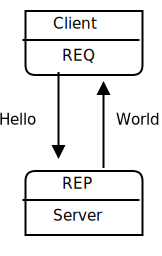
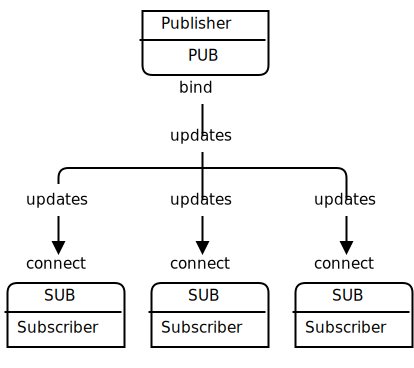
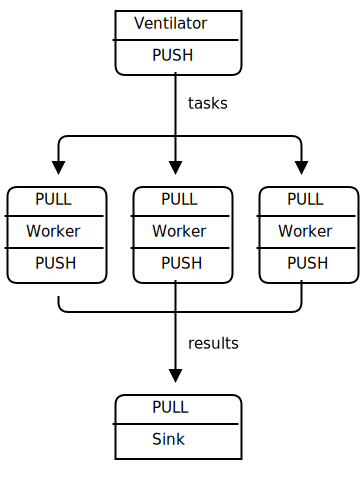

###############
第1章  基础知识
###############

`官方文档 <http://zguide.zeromq.org/page:all>`_

`PyZMQ Documentation <https://pyzmq.readthedocs.io/en/latest/>`_

`zmqpp : C++ style API <https://zeromq.github.io/zmqpp/>`_

* Ubuntu 

    .. code-block:: sh

        $ sudo aptitude install libzmq3-dev

获取示例
========

.. code-block:: sh

    $ git clone --depth=1 https://github.com/imatix/zguide.git

问过就必有收获
==============

因此,让我们先从一些代码起步。当然，我们讲以一个"HelloWorld"的例子开始。我们会制作一个客户端和服务器，客户端发送"Hello"到服务器，服务器用"World" 来应答（参见图1-1)。实例给出服务器代码，将5555端口上打开一个ØMQ套接字，读取请求并用"World" 应答每个请求。

*图1-1 请求-应答*
 

示例 HeloWorld服务器(hwserver.cpp)

.. literalinclude:: ../examples/C++/hwserver.cpp
    :language: cpp
    :encoding: utf-8
    :emphasize-lines: 20

示例 HeloWorld客户端代码(hwclient.cpp)

.. literalinclude:: ../examples/C++/hwclient.cpp
    :language: cpp
    :encoding: utf-8

编译

.. code-block:: sh

    $ g++ hwserver.cpp -o hwserver -lzmq
    $ g++ hwclient.cpp -o hwclient -lzmq

REQ-REP套接字对是步调一致的。客户端在一个循环中（或一次，根据需要而定）先发出 send(),然后在发出recv().任何其他序列（例如,一行中发送两个消息）将导致从send或者recv代码返回-1.同样的，服务器先发出recv(),然后再发出send ,按照这个顺序，根据需要多次重复。

在字符串上的小注解
==================

当从ØMQ用C接收字符串数据时，你根本无法相信他是安全的终止的。每一次你读到一个字符串时，都应该分配一个包含一个额外字节的新缓冲区，复制该字符串，并用正确的空字符串来终止它。

版本报告
========

.. literalinclude:: ../examples/C/version.c
    :language: c
    :encoding: utf-8
    :linenos:
    :lines: 1-11
    :emphasize-lines: 3,7-8

获取消息
========

*图 发布-订阅*
 

.. code-block:: cpp

    //  Weather update server in C++
    //  Binds PUB socket to tcp://*:5556
    //  Publishes random weather updates
    //
    //  Olivier Chamoux <olivier.chamoux@fr.thalesgroup.com>
    //
    #include <zmq.hpp>
    #include <stdio.h>
    #include <stdlib.h>
    #include <time.h>

    #if (defined (WIN32))
    #include <zhelpers.hpp>
    #endif

    #define within(num) (int) ((float) num * random () / (RAND_MAX + 1.0))

    int main () {

        //  Prepare our context and publisher
        zmq::context_t context (1);
        zmq::socket_t publisher (context, ZMQ_PUB);
        publisher.bind("tcp://*:5556");
        publisher.bind("ipc://weather.ipc");				// Not usable on Windows.

        //  Initialize random number generator
        srandom ((unsigned) time (NULL));
        while (1) {

            int zipcode, temperature, relhumidity;

            //  Get values that will fool the boss
            zipcode     = within (100000);
            temperature = within (215) - 80;
            relhumidity = within (50) + 10;

            //  Send message to all subscribers
            zmq::message_t message(20);
            snprintf ((char *) message.data(), 20 ,
                    "%05d %d %d", zipcode, temperature, relhumidity);
            publisher.send(message);

        }
        return 0;
    }

.. code-block:: cpp

    //  Weather update client in C++
    //  Connects SUB socket to tcp://localhost:5556
    //  Collects weather updates and finds avg temp in zipcode
    //
    //  Olivier Chamoux <olivier.chamoux@fr.thalesgroup.com>
    //
    #include <zmq.hpp>
    #include <iostream>
    #include <sstream>

    int main (int argc, char *argv[])
    {
        zmq::context_t context (1);

        //  Socket to talk to server
        std::cout << "Collecting updates from weather server...\n" << std::endl;
        zmq::socket_t subscriber (context, ZMQ_SUB);
        subscriber.connect("tcp://localhost:5556"); 
        // OR : subscriber.connect("ipc://weather.ipc");

        //  Subscribe to zipcode, default is NYC, 10001
        const char *filter = (argc > 1)? argv [1]: "10001 ";
        subscriber.setsockopt(ZMQ_SUBSCRIBE, filter, strlen (filter));

        //  Process 100 updates
        int update_nbr;
        long total_temp = 0;
        for (update_nbr = 0; update_nbr < 100; update_nbr++) {

            zmq::message_t update;
            int zipcode, temperature, relhumidity;

            subscriber.recv(&update);

            std::istringstream iss(static_cast<char*>(update.data()));
            iss >> zipcode >> temperature >> relhumidity ;

            total_temp += temperature;
        }
        std::cout << "Average temperature for zipcode '"<< filter
                  <<"' was "<<(int) (total_temp / update_nbr) <<"F"
                  << std::endl;
        return 0;
    }

.. code-block:: sh

    $ g++ wuserver.cpp -o wuserver -lzmq
    $ g++ wuclient.cpp -o wuclient -lzmq

关于PUB-SUB套接字还有一件更重要的事情需要了解: 你不知道订阅者开始得到消息的精确时间。即使你启动一个订阅者，稍等片刻，然后再启动发布者， **订阅者也总会错过发布者发送的第一个消息。** 这是因为当订阅者连接到发布者时，（这需要的时间很短，但非零），发布者可能已经将消息发送出去了。 

* 一个订阅者可以连接到多个发布者，每次使用一个connect 调用。那么数据将交错到达（"公平排队"),因此，没有任何一个发布者能淹没其他发布者。

分而治之
========

.. literalinclude:: ../examples/C++/taskvent.cpp
    :language: cpp
    :encoding: utf-8

 
.. literalinclude:: ../examples/C++/taskwork.cpp
    :language: cpp
    :encoding: utf-8

.. literalinclude:: ../examples/C++/tasksink.cpp
    :language: cpp
    :encoding: utf-8
    
.. code-block:: sh

    $ g++ taskvent.cpp -o taskvent -lzmq
    $ g++ taskwork.cpp -o taskwork -lzmq
    $ g++ tasksink.cpp -o tasksink -lzmq
     

用ØMQ编程
=========

获取正确的上下文
================

为什么我们需要ØMQ
=================

套接字的可扩展性
================

