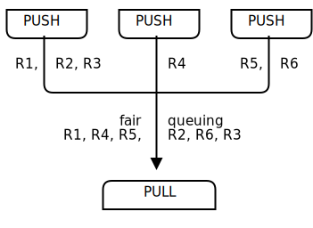

###############
第1章  基础知识
###############

`官方文档 <http://zguide.zeromq.org/page:all>`_

`PyZMQ Documentation <https://pyzmq.readthedocs.io/en/latest/>`_

API 
    `zmqpp : C++ style API <https://zeromq.github.io/zmqpp/>`_

* Ubuntu 

    .. code-block:: bash

        $ sudo aptitude install libzmq3-dev

修复这个世界
============

如何解释ZMQ？有些人会先说一堆ZMQ的好：它是一套用于快速构建的套接字组件；它的信箱系统有超强的路由能力；它太快了！而有些人则喜欢分享他们被ZMQ点悟的时刻，那些被灵感击中的瞬间：所有的事情突然变得简单明了，让人大开眼界。另一些人则会拿ZMQ同其他产品做个比较：它更小，更简单，但却让人觉得如此熟悉。对于我个人而言，我则更倾向于和别人分享ZMQ的诞生史，相信会和各位读者有所共鸣。

编程是一门科学，但往往会乔装成一门艺术。我们从不去了解软件最底层的机理，或者说根本没有人在乎这些。软件并不只是算法、数据结构、编程语言、或者抽象云云，这些不过是一些工具而已，被我们创造、使用、最后抛弃。软件真正的本质，其实是人的本质。

举例来说，当我们遇到一个高度复杂的问题时，我们会群策群力，分工合作，将问题拆分为若干个部分，一起解决。这里就体现了编程的科学：创建一组小型的构建模块，让人们易于理解和使用，那么大家就会一起用它来解决问题。

我们生活在一个普遍联系的世界里，需要现代的编程软件为我们做指引。所以，未来我们所需要的用于处理大规模计算的构建模块，必须是普遍联系的，而且能够并行运作。那时，程序代码不能再只关注自己，它们需要互相交流，变得足够健谈。程序代码需要像人脑一样，数以兆计的神经元高速地传输信号，在一个没有中央控制的环境下，没有单点故障的环境下，解决问题。这一点其实并不意外，因为就当今的网络来讲，每个节点其实就像是连接了一个人脑一样。

如果你曾和线程、协议、或网络打过交道，你会觉得我上面的话像是天方夜谭。因为在实际应用过程中，只是连接几个程序或网络就已经非常困难和麻烦了。数以兆计的节点？那真是无法想象的。现今只有资金雄厚的企业才能负担得起这种软件和服务。

当今世界的网络结构已经远远超越了我们自身的驾驭能力。十九世纪八十年代的软件危机，弗莱德•布鲁克斯曾说过，这个世上没有银弹。后来，免费和开源解决了这次软件危机，让我们能够高效地分享知识。如今，我们又面临一次新的软件危机，只不过我们谈论得不多。只有那些大型的、富足的企业才有财力建立高度联系的应用程序。那里有云的存在，但它是私有的。我们的数据和知识正在从我们的个人电脑中消失，流入云端，无法获得或与其竞争。是谁坐拥我们的社交网络？这真像一次巨型主机的革命。
我们暂且不谈其中的政治因素，光那些就可以另外出本书了。目前的现状是，虽然互联网能够让千万个程序相连，但我们之中的大多数却无法做到这些。这样一来，那些真正有趣的大型问题（如健康、教育、经济、交通等领域），仍然无法解决。我们没有能力将代码连接起来，也就不能像大脑中的神经元一样处理那些大规模的问题。

已经有人尝试用各种方法来连接应用程序，如数以千计的IETF规范，每种规范解决一个特定问题。对于开发人员来说，HTTP协议是比较简单和易用的，但这也往往让问题变得更糟，因为它鼓励人们形成一种重服务端、轻客户端的思想。

所以迄今为止人们还在使用原始的TCP/UDP协议、私有协议、HTTP协议、网络套接字等形式连接应用程序。这种做法依旧让人痛苦，速度慢又不易扩展，需要集中化管理。而分布式的P2P协议又仅仅适用于娱乐，而非真正的应用。有谁会使用Skype或者Bittorrent来交换数据呢？

这就让我们回归到编程科学的问题上来。想要拯救这个世界，我们需要做两件事情：一，如何在任何地点连接任何两个应用程序；二、将这个解决方案用最为简单的方式包装起来，供程序员使用。

也许这听起来太简单了，但事实确实如此。

本书读者对象
============

获取示例
========

.. code-block:: sh

    $ git clone --depth=1 https://github.com/imatix/zguide.git

问过就必有收获
==============

因此,让我们先从一些代码起步。当然，我们讲以一个"HelloWorld"的例子开始。我们会制作一个客户端和服务器，客户端发送"Hello"到服务器，服务器用"World" 来应答（参见图1-1)。实例给出服务器代码，将5555端口上打开一个ØMQ套接字，读取请求并用"World" 应答每个请求。

.. image:: ../images/fig2.svg
    :scale: 100%
    :alt: alternate text
    :align: center

.. raw:: html

    
图1-1 请求－应答

**示例 HeloWorld服务器 (hwserver.cpp)**

.. literalinclude:: ../examples/C/hwserver.c
    :language: cpp
    :encoding: utf-8
    :emphasize-lines: 20

示例 HeloWorld客户端代码(hwclient.cpp)

.. literalinclude:: ../examples/C/hwclient.c
    :language: cpp
    :encoding: utf-8

编译

.. code-block:: sh

    $ gcc hwserver.cpp -o hwserver -lzmq
    $ gcc hwclient.cpp -o hwclient -lzmq

REQ-REP套接字对是步调一致的。客户端在一个循环中（或一次，根据需要而定）先发出 send(),然后在发出recv().任何其他序列（例如,一行中发送两个消息）将导致从send或者recv代码返回-1.同样的，服务器先发出recv(),然后再发出send ,按照这个顺序，根据需要多次重复。

在字符串上的小注解
==================

当从ØMQ用C接收字符串数据时，你根本无法相信他是安全的终止的。每一次你读到一个字符串时，都应该分配一个包含一个额外字节的新缓冲区，复制该字符串，并用正确的空字符串来终止它。

版本报告
========

.. literalinclude:: ../examples/C/version.c
    :language: c
    :encoding: utf-8
    :linenos:
    :lines: 1-11
    :emphasize-lines: 3,7-8

获取消息
========

第二个经典的模式，是单向的数据发布，其中一台服务器将更新推送到一组客户端。
让我们看一个天气更新的例子，包括邮政编码，温度和相对湿度的例子。我们将使用随机值，就像真正的气象站那样。

天气更新服务端: wuserver

.. literalinclude:: ../examples/C/wuserver.c
    :language: c
    :encoding: utf-8

这个气象发布，是一个不停广播的死循环.

.. image:: ../images/fig4.svg
    :scale: 100%
    :alt: alternate text
    :align: center

.. raw:: html

    
图 发布-订阅

天气更新客户端: wuclient

.. literalinclude:: ../examples/C/wuclient.c
    :language: c
    :encoding: utf-8

.. code-block:: bash

    $ gcc wuserver.c -o wuserver -lzmq
    $ gcc wuclient.c -o wuclient -lzmq

需要注意的是，在使用SUB套接字时，必须使用zmq_setsockopt()函数和 SUBSCRIBE 来设置订阅的内容。如果你不设置订阅内容，那将什么消息都收不到，新手很容易犯这个错误。订阅信息可以是任何字符串，可以设置多次。只要消息满足其中一条订阅信息，SUB套接字就会收到。订阅者可以选择不接收某类消息，要了解这是如何工作的。请参见 zmq_setsockopt_ ().

.. _zmq_setsockopt: http://api.zeromq.org/4-2:zmq-setsockopt

该PUB-SUB 套接字对是异步的。客户端在一个循环中（或一次，根据需要而定）执行zmq_msg_recv(). 试图将消息发送到一个SUB套接字会导致错误。同样，服务根据需要多次执行zmq_msg_send(). 但不能在PUB套接字上执行zmq_msg_recv().

从理论上讲，使用ZMQ套接字不关心哪端连接和哪端绑定。然而，在实践中有未在文档中记录的差异，我稍后就会提到它。就目前而言，只要绑定PUB并连接SUB就可以了，除非你的网络设计是的这行不通。

关于PUB-SUB套接字还有一件更重要的事情需要了解: 你不知道订阅者开始得到消息的精确时间。即使你启动一个订阅者，稍等片刻，然后再启动发布者， **订阅者也总会错过发布者发送的第一个消息。** 这是因为当订阅者连接到发布者时，（这需要的时间很短，但非零），发布者可能已经将消息发送出去了。 

这种"慢木匠"症状经常会击中足够多的人，那我们要详细解释一下。请记住，ZMQ执行异步I/O(即台后).假设你有两个节点执行此操作，顺序如下:

    * 订阅者连接到一个端点，并接收和清点消息。
    * 发布者绑定到一个端点，并立即发送1000条消息。 

订阅者很可能不会收到任何东西。你会傻眼，检查你是否设定了一个正确的过滤器，然后再试一次，而订阅者任然没有收到任何东西。

我们知道在建立TCP连接时需要进行三次握手，会耗费几毫秒的时间，而当节点数增加时这个数字也会上升。在这么短的时间里，ZMQ就可以发送很多很多消息了。举例来说，如果建立连接需要耗时5毫秒，而ZMQ只需要1毫秒就可以发送完这1000条消息。

第二章中我会解释如何使发布者和订阅者同步，只有当订阅者准备好时发布者才会开始发送消息。有一种简单的方法来同步PUB和SUB，就是让PUB延迟一段时间再发送消息。现实编程中我不建议使用这种方式，因为它太脆弱了，而且不好控制。不过这里我们先暂且使用sleep的方式来解决，等到第二章的时候再讲述正确的处理方式。

另一种同步的方式则是认为发布者的消息流是无穷无尽的，因此丢失了前面一部分信息也没有关系。我们的气象信息客户端就是这么做的。

示例中的气象信息客户端会收集指定邮编的一千条信息，其间大约有1000万条信息被发布。你可以先打开客户端，再打开服务端，工作一段时间后重启服务端，这时客户端仍会正常工作。当客户端收集完所需信息后，会计算并输出平均温度

关于发布-订阅模式的几点说明：

* 订阅者可以连接多个发布者，轮流接收消息；
* 如果发布者没有订阅者与之相连，那它发送的消息将直接被丢弃；
* 如果你使用TCP协议，那当订阅者处理速度过慢时，消息会在发布者处堆积。以后我们会讨论如何使用阈值（HWM）来保护发布者。
* 在目前版本的ZMQ中，消息的过滤是在订阅者处进行的。也就是说，发布者会向订阅者发送所有的消息，订阅者会将未订阅的消息丢弃
 

分布式处理
===========

下面一个示例程序中，我们将使用ZMQ进行超级计算，也就是并行处理模型：

* 任务分发器会生成大量可以并行计算的任务；
* 有一组worker会处理这些任务；
* 结果收集器会在末端接收所有worker的处理结果，进行汇总。
* 现实中，worker可能散落在不同的计算机中，利用GPU（图像处理单元）进行复杂计算。下面是任务分发器的代码，它会生成100个任务，任务内容是让收到的worker延迟若干毫秒。

.. image:: ../images/fig5.svg
    :scale: 100%
    :alt: alternate text
    :align: center

并行任务分发器(taskvent)
    现实中，worker可能散落在不同的计算机中，利用GPU（图像处理单元）进行复杂计算。下面是任务分发器的代码，它会生成100个任务，任务内容是让收到的worker延迟若干毫秒。

.. literalinclude:: ../examples/C/taskvent.c
    :language: cpp
    :encoding: utf-8

 
并行任务工人(taskwork)
    它接受信息并延迟指定的毫秒数，并发送执行完毕的信号.

.. literalinclude:: ../examples/C/taskwork.c
    :language: cpp
    :encoding: utf-8

并行任务接收器(tasksink)
    它会收集100个处理结果，并计算总的执行时间，让我们由此判别任务是否是并行计算的。

.. literalinclude:: ../examples/C/tasksink.c
    :language: cpp
    :encoding: utf-8
    
.. code-block:: sh

    $ gcc taskvent.cpp -o taskvent -lzmq
    $ gcc taskwork.cpp -o taskwork -lzmq
    $ gcc tasksink.cpp -o tasksink -lzmq
     
.. seealso::
    * 1. 先启动一个(或多个 taskwork).
    * 2. 再启动 tasksink .
    * 3. 最后启动 taskvent .

关于这段代码的几个细节：

* worker上游和任务分发器相连，下游和结果收集器相连，这就意味着你可以开启任意多个worker。但若worker是绑定至端点的，而非连接至端点，那我们就需要准备更多的端点，并配置任务分发器和结果收集器。所以说，任务分发器和结果收集器是这个网络结构中较为稳定的部分，因此应该由它们绑定至端点，而非worker，因为它们较为动态。
* 我们需要做一些同步的工作，等待worker全部启动之后再分发任务。这点在ZMQ中很重要，且不易解决。连接套接字的动作会耗费一定的时间，因此当第一个worker连接成功时，它会一下收到很多任务。所以说，如果我们不进行同步，那这些任务根本就不会被并行地执行。你可以自己试验一下。
* 任务分发器使用PUSH套接字向worker均匀地分发任务（假设所有的worker都已经连接上了），这种机制称为 *负载均衡* ，以后我们会见得更多。
* 结果收集器的PULL套接字会均匀地从worker处收集消息，这种机制称为 *公平队列*：

管道模式也会出现"慢木匠"的情况，让人误以为PUSH套接字没有进行负载均衡。如果你的程序中某个worker接收到了更多的请求，那是因为它的PULL套接字连接得比较快，从而在别的worker连接之前获取了额外的消息。

用ØMQ编程
=========

正确的使用上下文
================

ZMQ应用程序的一开始总是会先创建一个上下文，并用它来创建套接字。在C语言中，创建上下文的函数是zmq_ctx_new()。一个进程中只应该创建一个上下文。从技术的角度来说，上下文是一个容器，包含了该进程中所有的套接字，并为inproc协议提供实现，用以高速连接进程内不同的线程。如果一个进程中创建了两个上下文，那就相当于启动了两个ZMQ实例。如果这正是你需要的，那没有问题，但一般情况下：

**在一个进程中使用zmq_ctx_new()函数创建一个上下文，并在结束时使用zmq_ctx_destroy()函数关闭它.**

如果你使用了fork()系统调用，那每个进程需要自己的上下文对象。如果在调用fork()之前调用了zmq_ctx_new()函数，那每个子进程都会有自己的上下文对象。通常情况下，你会需要在子进程中做些有趣的事，而让父进程来管理它们。

正确退出和清理
==============

程序员的一个良好习惯是：总是在结束时进行清理工作。当你使用像Python那样的语言编写ZMQ应用程序时，系统会自动帮你完成清理。但如果使用的是C语言，那就需要小心地处理了，否则可能发生内存泄露、应用程序不稳定等问题。

内存泄露只是问题之一，其实ZMQ是很在意程序的退出方式的。个中原因比较复杂，但简单的来说，如果仍有套接字处于打开状态，调用zmq_ctx_destroy()时会导致程序挂起；就算关闭了所有的套接字，如果仍有消息处于待发送状态，zmq_ctx_destroy()也会造成程序的等待。只有当套接字的LINGER选项设为0时才能避免。

我们需要关注的ZMQ对象包括：消息、套接字、上下文。好在内容并不多，至少在一般的应用程序中是这样：

处理完消息后，记得用zmq_msg_close()函数关闭消息；
如果你同时打开或关闭了很多套接字，那可能需要重新规划一下程序的结构了；
退出程序时，应该先关闭所有的套接字，最后调用zmq_ctx_destroy()函数，销毁上下文对象。
如果要用ZMQ进行多线程的编程，需要考虑的问题就更多了。我们会在下一章中详述多线程编程，但如果你耐不住性子想要尝试一下，以下是在退出时的一些建议：

不要在多个线程中使用同一个套接字。不要去想为什么，反正别这么干就是了。
关闭所有的套接字，并在主程序中关闭上下文对象。
如果仍有处于阻塞状态的recv或poll调用，应该在主程序中捕捉这些错误，并在相应的线程中关闭套接字。不要重复关闭上下文，zmq_ctx_destroy()函数会等待所有的套接字安全地关闭后才结束。
看吧，过程是复杂的，所以不同语言的API实现者可能会将这些步骤封装起来，让结束程序变得不那么复杂。

为什么我们需要ØMQ
=================

套接字的可扩展性
================

